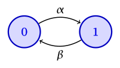
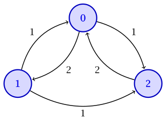
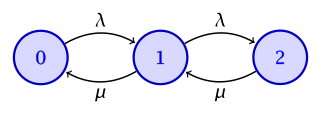

In this lecture, we pass from discrete-time Markov chains to continuous time. In discrete time, the process can change state only at integer times. A **continuous-time Markov chain** $\{X(t)\}_{t \ge 0}$ can change state at any time. As before, the state summarizes all the information from the past that is relevant for the future: conditioned on $X(t)$, the evolution after time $t$ is independent of the evolution before time $t$. We focus on time-homogeneous chains on a finite state space $\ALPHABET X$.

## Holding times and the embedded chain

1. Continuous-time Markov chains are constructed as follows. Whenever the chain enters state $i$, it remains there for an exponentially distributed **holding time** with rate $ν_i$. At the end of the holding time, it jumps to state $j$ with probability $P_{ij}$, where
   $$ P_{ii} = 0, \quad \sum_{j \ne i} P_{ij} = 1. $$
   The successive states visited by the process form a discrete-time Markov chain with transition matrix $P$, called the **embedded jump chain**. The rates $ν_i$ determine when the process jumps; $P$ determines where it jumps.

   If $ν_i = 0$, state $i$ is absorbing and its holding time is infinite. In that case, the corresponding row of $P$ is irrelevant.

2. The **transition rate** from state $i$ to state $j$ is
   $$ q_{ij} = ν_i P_{ij}, \qquad j \ne i. $$
   Hence
   $$ ν_i = \sum_{j \ne i} q_{ij}, \qquad P_{ij} = \frac{q_{ij}}{ν_i} $$
   whenever $ν_i > 0$. Specifying the holding rates and the embedded jump probabilities is equivalent to specifying the transition rates $q_{ij}$.

3. There is a useful equivalent picture. While the process is in state $i$, imagine an independent exponential clock of rate $q_{ij}$ for every $j \ne i$. The first clock to ring determines the next state. The minimum of these clocks is exponential with rate
   $$ \sum_{j \ne i} q_{ij} = ν_i, $$
   and clock $j$ rings first with probability
   $$ \frac{q_{ij}}{ν_i} = P_{ij}. $$
   This is the **competing exponential clocks** construction. It is the same mechanism we used for competing Poisson processes.

4. The transition rates are collected in the **generator matrix** $Q$, where
   $$ Q_{ij} = q_{ij} \quad (j \ne i), \qquad Q_{ii} = -\sum_{j \ne i} q_{ij} = -ν_i. $$
   The off-diagonal entries of $Q$ are nonnegative and every row sums to zero:
   $$ Q\mathbf 1 = \mathbf 0. $$
   As in discrete time, a time-homogeneous continuous-time Markov chain is completely specified by its initial distribution and $Q$.

5. Such Markov chains can also be visualized using **state transition diagrams**. The drawing convention is the same as in discrete time, with one difference: the edge labels are the off-diagonal rates $q_{ij}$ from $Q$, and self-loops are **not** drawn. In discrete time, a self-loop at $i$ records $P_{ii}$. In continuous time, remaining in $i$ for a short interval is already encoded by the holding rate $ν_i = -Q_{ii}$, so a self-loop is redundant.

   Given a diagram, the generator is recovered by reading $Q_{ij} = q_{ij}$ from the directed edge $i \to j$ (for $j \ne i$) and setting
   $$ Q_{ii} = -\sum_{j \ne i} q_{ij}. $$
   The holding rates and embedded jump probabilities then follow from
   $$ ν_i = -Q_{ii}, \qquad P_{ij} = \frac{q_{ij}}{ν_i} \quad (j \ne i), \qquad P_{ii} = 0, $$
   whenever $ν_i > 0$.

6. :::{#exm-two-state-ctmc}
   #### Two-state continuous-time Markov chain

   Suppose a system switches from state $0$ to state $1$ at rate $α > 0$ and from state $1$ to state $0$ at rate $β > 0$. The holding times in $0$ and $1$ are exponential with rates $α$ and $β$. The embedded jump chain alternates between the two states, and the generator is
   $$ Q = \MATRIX{-α & α \\ β & -β}. $$
   For example, this can model a component that fails at rate $α$ and is repaired at rate $β$. The corresponding diagram has an edge $0 \to 1$ labeled $α$ and an edge $1 \to 0$ labeled $β$, with no self-loops.

   
   :::

7. :::{#exm-ctmc-diagram-three-state}
   #### From $Q$ to a diagram: three states

   Consider
   $$ Q = \MATRIX{-3 & 2 & 1 \\ 1 & -2 & 1 \\ 2 & 0 & -2}. $$
   The off-diagonal entries become edge labels: $0 \to 1$ at rate $2$, $0 \to 2$ at rate $1$, $1 \to 0$ and $1 \to 2$ at rate $1$, and $2 \to 0$ at rate $2$. There is no edge $2 \to 1$, since $Q_{21} = 0$. There are no self-loops; the diagonal entries $-3$, $-2$, and $-2$ are minus the total outgoing rate from each state.

   
   :::

8. :::{#exm-finite-buffer-queue}
   #### A finite-buffer packet queue

   Packets arrive at a buffer according to a Poisson process with rate $λ$, and their service times are independent exponential random variables with rate $μ$. The buffer can hold at most two packets, including the packet in service. Let $X(t)$ be the number of packets in the buffer at time $t$. An arrival in state $2$ is discarded and does not change the state.

   

   Read the diagram to determine the generator $Q$, the holding rates $ν$, and the embedded jump matrix $P$.

   :::{.callout-note collapse="true"}
   #### Solution

   The edges give $q_{01} = λ$, $q_{10} = μ$, $q_{12} = λ$, and $q_{21} = μ$, with all other off-diagonal rates equal to zero. Completing the diagonal yields
   $$ Q = \MATRIX{-λ & λ & 0 \\ μ & -(λ + μ) & λ \\ 0 & μ & -μ}. $$
   The holding rates are the negatives of the diagonal,
   $$ ν = \MATRIX{λ & λ + μ & μ}, $$
   and normalizing each nonzero row of off-diagonal rates gives
   $$ P = \MATRIX{0 & 1 & 0 \\ \frac{μ}{λ + μ} & 0 & \frac{λ}{λ + μ} \\ 0 & 1 & 0}. $$
   Thus state $0$ always jumps to $1$, state $2$ always jumps to $1$, and from state $1$ the chain jumps to $0$ or $2$ with probabilities proportional to $μ$ and $λ$.
   :::
   :::

## Transition probabilities

1. Recall that a Poisson process with rate $λ$ satisfies, over a short interval of length $h$,
   \begin{align*}
     \PR(N(t + h) - N(t) = 0) &= 1 - λh + o(h), \\
     \PR(N(t + h) - N(t) = 1) &= λh + o(h), \\
     \PR(N(t + h) - N(t) \ge 2) &= o(h).
   \end{align*}
   Here $o(h)$ denotes a term negligible compared with $h$, i.e.,
   $$ \frac{o(h)}{h} \longrightarrow 0 \quad\text{as }h \to 0. $$

2. Continuous-time Markov chains have the same local description. The probability of leaving state $i$ in an interval of length $h$ is $ν_i h + o(h)$. For $j \ne i$,
   $$ \PR(X(t + h) = j \mid X(t) = i) = q_{ij} h + o(h). $$
   Likewise,
   $$ \PR(X(t + h) = i \mid X(t) = i) = 1 - ν_i h + o(h). $$
   To first order in $h$, remaining in $i$ means that no jump occurs in the interval. Leaving $i$ and returning requires at least two jumps, which has probability $o(h)$. Our convention $P_{ii} = 0$ for the embedded chain does not prevent $X(t + h) = i$.

3. Define the transition probabilities
   $$ P_{ij}(t) = \PR(X(t) = j \mid X(0) = i). $$
   By time homogeneity, this is also $\PR(X(s + t) = j \mid X(s) = i)$ for any starting time $s$. Let $P(t)$ denote the matrix with entries $P_{ij}(t)$. Each $P(t)$ is row stochastic, and
   $$ P(0) = I. $$
   The notation $P(t)$ should not be confused with the matrix $P$ of the embedded jump chain. The local description above is equivalent to
   $$ P(h) = I + hQ + o(h). $$

4. Conditioning on the state after time $s$ gives the **Chapman--Kolmogorov equations**
   $$ P_{ij}(s + t) = \sum_{k \in \ALPHABET X} P_{ik}(s) P_{kj}(t), $$
   or, in matrix notation,
   $$ P(s + t) = P(s) P(t). $$

5. Combining the Chapman--Kolmogorov equations with
   $$ P(h) = I + hQ + o(h) $$
   gives the **forward equation**. Writing
   $$ P(t + h) = P(t) P(h) $$
   and taking $h \to 0$ yields
   $$ \frac{d}{dt} P(t) = P(t) Q. $$
   With $P(0) = I$, the solution is
   $$ P(t) = \exp(tQ) = I + tQ + \frac{t^2 Q^2}{2!} + \cdots. $$

6. Let $μ(t)$ be the row vector of state occupancy probabilities,
   $$ μ_i(t) = \PR(X(t) = i). $$
   Then
   $$ μ(t) = μ(0) P(t), $$
   and the forward equation implies
   $$ \frac{d}{dt} μ(t) = μ(t) Q. $$
   Component-wise,
   $$ \frac{d}{dt} μ_j(t) = \sum_{i \ne j} μ_i(t) q_{ij} - μ_j(t) \sum_{k \ne j} q_{jk}. $$
   The rate of change of the probability of state $j$ is the probability flow into $j$ minus the probability flow out of $j$.

7. For the two-state chain in @exm-two-state-ctmc,
   $$
     P(t) = \frac{1}{α + β}
     \MATRIX{
     β + α e^{-(α + β)t} & α\bigl(1 - e^{-(α + β)t}\bigr) \\
     β\bigl(1 - e^{-(α + β)t}\bigr) & α + β e^{-(α + β)t}
     }.
   $$
   As $t \to \infty$, both rows converge to
   $$ π = \frac{1}{α + β} \MATRIX{β & α}. $$

## Class structure and hitting times

1. For a nonabsorbing state $i$, there is a directed edge $i \to j$ in the continuous-time chain whenever $q_{ij} > 0$, equivalently whenever $P_{ij} > 0$ in the embedded chain. Thus the continuous-time chain and its embedded chain have the same accessibility relations, communicating classes, closed classes, and irreducibility. A state with $ν_i = 0$ is an absorbing singleton class; its row in $P$ remains irrelevant. The class structure can therefore be read from the embedded chain, using the results for discrete-time Markov chains. Periodicity, however, is not a condition that carries over to continuous time.

2. For a set of states $A$, define the **hitting time**
   $$ H_A = \inf\{t \ge 0 : X(t) \in A\}. $$
   Whether the chain reaches $A$ depends on the sequence of states visited, not on the time spent in those states. Consequently, the hitting probabilities
   $$ h_i = \PR_i(H_A < \infty) $$
   are the same as for the embedded chain. They satisfy
   $$ h_i = 1, \quad i \in A, \qquad h_i = \sum_j P_{ij} h_j, \quad i \notin A,\ ν_i > 0. $$
   Equivalently,
   $$ \sum_j q_{ij} h_j = 0, \qquad i \notin A,\ ν_i > 0. $$
   An absorbing state outside $A$ has hitting probability zero. Absorption probabilities are obtained in the same way. As in discrete time, the desired probabilities are the minimal nonnegative solution when the equations do not have a unique solution.

3. The **mean hitting time** does depend on the holding rates. Let
   $$ m_i = \EXP_i[H_A]. $$
   Starting from $i \notin A$, the process first spends a mean time $1/ν_i$ in state $i$ and then moves according to $P$. Hence
   $$ m_i = 0, \quad i \in A, \qquad m_i = \frac{1}{ν_i} + \sum_j P_{ij} m_j, \quad i \notin A,\ ν_i > 0. $$
   Equivalently,
   $$ \sum_j q_{ij} m_j = -1, \qquad i \notin A,\ ν_i > 0. $$
   An absorbing state outside $A$ has infinite mean hitting time. The embedded path determines whether a set is reached; the holding rates determine how much time elapses before it is reached. The number of jumps alone determines the continuous-time mean only when all relevant holding rates are the same.

4. :::{#exm-ctmc-mean-hitting}
   #### Mean hitting times for the three-state chain

   Consider the three-state chain in @exm-ctmc-diagram-three-state, and let $A = \{0\}$. The chain is irreducible, so $H_A$ is almost surely finite from every state. Write $m_i = \EXP_i[H_A]$ for the mean time to reach state $0$. Then $m_0 = 0$.

   From state $2$, the chain can jump only to $0$, at rate $2$. Hence
   $$ m_2 = \frac{1}{2}. $$
   From state $1$, the holding rate is $ν_1 = 2$ and the embedded chain jumps to $0$ or $2$ with equal probability. Therefore
   $$ m_1 = \frac{1}{2} + \frac{1}{2} m_0 + \frac{1}{2} m_2 = \frac{1}{2} + \frac{1}{2} \cdot \frac{1}{2} = \frac{3}{4}. $$
   Equivalently, the generator equations $\sum_j q_{ij} m_j = -1$ for $i \notin A$ are
   \begin{align*}
     m_0 - 2 m_1 + m_2 &= -1, \\
     2 m_0 - 2 m_2 &= -1.
   \end{align*}
   With $m_0 = 0$, the second equation gives $m_2 = 1/2$, and then the first gives $m_1 = 3/4$.
   :::

## Invariant distributions

1. A probability row vector $π$ is an **invariant distribution** if initializing the chain with $X(0) \sim π$ gives $X(t) \sim π$ for every $t \ge 0$. Equivalently,
   $$ π P(t) = π \qquad\text{for every }t \ge 0. $$

2. Since $P(t) = \exp(tQ)$, invariance is equivalent to
   $$ π Q = \mathbf 0, \qquad π \mathbf 1 = 1. $$
   These are the continuous-time balance equations. As in discrete time, they say that under $π$ the total probability flow into each state equals the total probability flow out of that state.

3. The invariant distribution of the embedded jump chain is related to that of the continuous-time chain. Suppose the chain is finite and irreducible, with $ν_i > 0$ for every state, and let $π^{\mathrm{embed}}$ denote the invariant distribution of the embedded chain:
   $$ π^{\mathrm{embed}} = π^{\mathrm{embed}} P. $$
   If $D_ν = \operatorname{diag}(ν_i)$, then
   $$ Q = D_ν(P - I). $$
   Consequently, $π Q = \mathbf 0$ implies that $π D_ν$ is invariant for $P$. After normalization,
   \begin{equation}\label{eq:embedded-ctmc-invariant-relation}
     π_i^{\mathrm{embed}}
     = \frac{π_i ν_i}{\sum_k π_k ν_k},
     \qquad
     π_i
     = \frac{π_i^{\mathrm{embed}} / ν_i}
            {\sum_k π_k^{\mathrm{embed}} / ν_k}.
   \end{equation}
   The embedded chain records the fraction of jumps into each state. The continuous-time chain weights each visit by its mean holding time $1/ν_i$, so states with longer holding times receive more probability under $π$.

4. For the two-state chain, the embedded chain alternates between the two states, so
   $$ π^{\mathrm{embed}} = \MATRIX{1/2 & 1/2}. $$
   Since $ν_0 = α$ and $ν_1 = β$, \eqref{eq:embedded-ctmc-invariant-relation} gives
   $$ π = \frac{1}{α + β} \MATRIX{β & α}, $$
   which satisfies $π Q = \mathbf 0$. This agrees with the limiting distribution found above.

5. For a finite irreducible continuous-time Markov chain, the invariant distribution is unique and
   $$ \lim_{t \to \infty} P_{ij}(t) = π_j. $$
   Unlike a discrete-time chain, no separate aperiodicity assumption is needed. For any fixed $Δ > 0$, the sampled chain with transition matrix $P(Δ)$ is irreducible and has a positive probability of remaining in its current state during an interval of length $Δ$. It is therefore aperiodic, and the discrete-time convergence result applies to the sampled chain. The continuous-time semigroup property then gives convergence for all $t \to \infty$.

6. More generally, suppose the packet buffer in @exm-finite-buffer-queue can hold $m$ packets. Its state space is $\{0, 1, \ldots, m\}$, and its transition rates are
   $$ q_{i,i+1} = λ, \quad i < m, \qquad q_{i,i-1} = μ, \quad i > 0. $$
   Arrivals in state $m$ are discarded and do not change the state. The balance equations give, with $ρ = λ/μ$,
   $$ π_i = ρ^i π_0, \qquad i = 0, 1, \ldots, m. $$
   Therefore,
   $$
     π_i =
     \begin{cases}
     \displaystyle\frac{(1 - ρ)ρ^i}{1 - ρ^{m+1}}, & ρ \ne 1, \\
     \displaystyle\frac{1}{m+1}, & ρ = 1.
     \end{cases}
   $$
   Since packets arrive according to a Poisson process at a rate that does not depend on the state, an arriving packet finds the buffer full with probability $π_m$. Thus $π_m$ is the **blocking probability**, and
   $$ λ(1 - π_m) $$
   is the rate at which packets are admitted to the buffer.

## Exercises {-}

1. Let $\{N(t)\}_{t \ge 0}$ be a Poisson process with rate $λ$, and write
   $$ p_n(t) = \PR(N(t) = n). $$
   Use the short-interval probabilities above to show that
   $$ p_0'(t) = -λ p_0(t), \qquad p_n'(t) = λ p_{n-1}(t) - λ p_n(t), \quad n \ge 1. $$
   Solve these equations using $p_0(0) = 1$ and $p_n(0) = 0$ for $n \ge 1$. These are the simplest examples of the forward equations for a continuous-time Markov chain.

2. Consider the two-state continuous-time Markov chain in @exm-two-state-ctmc. Verify directly that its transition matrix satisfies
   $$ P'(t) = P(t) Q. $$

3. Consider a three-state continuous-time Markov chain with generator
   $$ Q = \MATRIX{-3 & 2 & 1 \\ 1 & -2 & 1 \\ 2 & 0 & -2}. $$
   Find its holding rates, embedded jump transition matrix, and invariant distribution.
