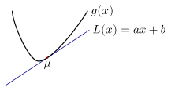

## Union Bound

:::{.callout-tip}
### Union bound

Let $A_1, \dots, A_n$ be a collection of events. Then,
$$
\PR\biggl( \bigcup_{i=1}^n A_i \biggr) 
\le 
\sum_{i=1}^n \PR(A_i).
$$

:::

We already proved this when talking about [probability spaces](probability-spaces.qmd#lem-probability-properties).

:::{#exm-union-bound}
Let $X_1, \dots, X_n$ be i.i.d. random variables with CDF $F_X(x)$. Find an upper bound on the CDF of
$$
Z_n = \min(X_1, \dots, X_n).
$$
:::

:::{.callout-note collapse="false"}
### Solution
The event $Z_n\le z$ occurs if and only if at least one $X_i\le z$. Therefore,
$$
\PR(Z_n\le z)
=\PR\biggl(\bigcup_{i=1}^n\{X_i\le z\}\biggr)
\le\sum_{i=1}^n\PR(X_i\le z)
=nF_X(z).
$$
Since the random variables are independent, the exact CDF is
$$
F_{Z_n}(z)
=1-\PR(X_1>z,\ldots,X_n>z)
=1-\bigl(1-F_X(z)\bigr)^n.
$$
Thus, the union bound gives
$$
1-\bigl(1-F_X(z)\bigr)^n\le nF_X(z).
$$
:::

:::{#exm-union-bound-process-maximum}
Let $\{X_k\}_{k\ge1}$ be a sequence of random variables. Show that, for every $a\in\reals$ and $n\ge1$,
$$
\PR\left(\max_{1\le k\le n}X_k\ge a\right)
\le\sum_{k=1}^n\PR(X_k\ge a).
$$
Does this bound require the random variables $X_1,\ldots,X_n$ to be independent?
:::

:::{.callout-note collapse="true"}
### Solution

The event that at least one of the first $n$ random variables exceeds $a$ is
$$
\left\{\max_{1\le k\le n}X_k\ge a\right\}
=\bigcup_{k=1}^n\{X_k\ge a\}.
$$
Therefore, the union bound gives
$$
\PR\left(\max_{1\le k\le n}X_k\ge a\right)
\le\sum_{k=1}^n\PR(X_k\ge a).
$$
No independence assumption is needed. In particular, if the $X_k$ have the same marginal distribution, then
$$
\PR\left(\max_{1\le k\le n}X_k\ge a\right)
\le n\PR(X_1\ge a).
$$
Thus, the union bound converts individual tail bounds into a bound on the maximum of several random variables.
:::

:::{#exm-union-bound-infinite-events}
Let $\{A_i\}_{i = 1}^{∞}$ be a countably infinite sequence of events. Show that

a. If $\PR(A_i) = 0$ for all $i \in \naturalnumbers$, then
   $$ \PR\Bigl( \bigcup_{i=1}^{∞} A_i \Bigr) = 0. $$
b. If $\PR(A_i) = 1$ for all $i \in \naturalnumbers$, then
   $$ \PR\Bigl( \bigcap_{i=1}^{∞} A_i \Bigr) = 1. $$

:::

## Cauchy–Schwarz inequality {#cauchy-schwarz-inequality}

This is the Cauchy–Schwarz inequality for the inner product $\IP{X}{Y}=\EXP[XY]$ on square-integrable random variables.

:::{.callout-tip}
### Cauchy–Schwarz inequality

Let $X$ and $Y$ be real-valued random variables with finite second moments. Then,
$$
(\EXP[XY])^2 \le \EXP[X^2] \EXP[Y^2].
$$
Applying this inequality to the centered random variables $X-\EXP[X]$ and $Y-\EXP[Y]$ gives
$$
\COV(X,Y)^2 \le \VAR(X) \VAR(Y).
$$
:::

:::{.callout-note collapse="false"}
### Proof

If $\EXP[X^2]=0$, then $X=0$ almost surely and the result is immediate. Otherwise, define
$$
f(s)=\EXP[(sX+Y)^2],
\qquad s\in\reals.
$$
By linearity of expectation,
$$
f(s) = \EXP[ (sX + Y)^2 ] = s^2 \EXP[X^2] + 2s \EXP[XY] + \EXP[Y^2].
$$
We know that $f(s) \ge 0$. A quadratic
$$
A s^2 + B s + C \ge 0
$$ 
for every $s$, with $A>0$, must have non-positive discriminant:
$$
Δ = B^2 - 4AC \le 0.
$$
Taking $A = \EXP[X^2]$, $B = 2 \EXP[XY]$, and $C = \EXP[Y^2]$ gives
$$
(\EXP[XY])^2\le\EXP[X^2]\EXP[Y^2].
$$
The covariance inequality follows by applying this result to $X-\EXP[X]$ and $Y-\EXP[Y]$.
:::

The following exercise establishes the **Paley--Zygmund inequality**, which gives a lower bound on the probability that a non-negative random variable is not too far below its mean.

:::{#exm-2025-mid-term-4}
Let $X \ge 0$ be a random variable with mean $μ>0$ and finite variance $σ^2$. Given $λ \in (0,1)$, define
$$A = \{ ω : X(ω) \ge λ μ \}.$$

a. Show that
   $$\EXP[ X \IND_{A} ] \ge (1 -λ) μ. $$

    _Hint:_ Note that $X = X (\IND_A + \IND_{A^c})$. What do we know about $X$ when $ω \in A^c$?

b. Using the result of part (a), show that
   $$
     \PR(X \ge λ μ) \ge (1-λ)^2 \frac{ \EXP[X]^2 }{\EXP[X^2]}
     = (1-λ)^2 \frac{μ^2}{μ^2 + σ^2}.   
   $$

      _Hint:_ Use Cauchy–Schwarz to bound $\EXP[X \IND_A]$.
:::

:::{.callout-note collapse="true"}
### Solution

On $A^c$, we have $X<λμ$. Therefore,
$$
X\IND_{A^c}\le λμ\IND_{A^c}\le λμ.
$$
Using $X=X\IND_A+X\IND_{A^c}$ gives
$$
μ
=\EXP[X\IND_A]+\EXP[X\IND_{A^c}]
\le\EXP[X\IND_A]+λμ,
$$
and hence
$$
\EXP[X\IND_A]\ge(1-λ)μ.
$$

By the Cauchy–Schwarz inequality,
$$
(\EXP[X\IND_A])^2
\le\EXP[X^2]\EXP[\IND_A^2]
=\EXP[X^2]\PR(A).
$$
Combining this with part (a) yields
\begin{align*}
\PR(X\ge λμ)
=\PR(A)
&\ge\frac{(\EXP[X\IND_A])^2}{\EXP[X^2]}\\
&\ge(1-λ)^2\frac{μ^2}{\EXP[X^2]}\\
&=(1-λ)^2\frac{μ^2}{μ^2+σ^2}.
\end{align*}
:::

## Jensen's inequality

If we take $Y = 1$ in the Cauchy–Schwarz inequality, we get that
$$
\EXP[X^2] \ge \EXP[X]^2.
$$
This also follows from the fact that $\VAR(X) \ge 0$. Jensen's inequality may be thought as a generalization of this to convex functions.

:::{.callout-tip}
### Jensen's inequality

Let $X$ be an integrable random variable taking values in an interval $I$, and let $g\colon I\to\reals$ be **convex**. If $g(X)$ is integrable, then
$$
\EXP[ g(X) ] \ge g(\EXP[X]).
$$

If $g\colon I\to\reals$ is **concave** and $g(X)$ is integrable, then
$$
\EXP[ g(X) ] \le g(\EXP[X]).
$$
:::

For example, $g(x)=1/x$ is convex on $(0,∞)$ and $g(x)=\log x$ is concave on $(0,∞)$. Thus, if $X>0$ almost surely and the relevant expectations are finite, then
$$
\EXP\left[\frac1X\right]\ge\frac1{\EXP[X]}
\qquad\text{and}\qquad
\EXP[\log X]\le\log(\EXP[X]).
$$

:::{.callout-note collapse="false"}
#### Proof

{#fig-tangent}

Let $μ=\EXP[X]$, and consider an affine supporting line to $g$ at $μ$, as illustrated in @fig-tangent. Thus, $L(x)=ax+b$ for some $a,b\in\reals$, and
$$
L(μ)=g(μ)
\qquad\text{and}\qquad
L(x)\le g(x),\quad x\in I.
$$
Convexity guarantees the existence of such a supporting line, even when $g$ is not differentiable at $μ$. If $g$ is differentiable at $μ$, the supporting line is the tangent line; otherwise, its slope $a$ is a subgradient of $g$ at $μ$. Therefore,
$$
  \EXP[g(X)] \ge \EXP[L(X)]
  = \EXP[aX + b] = a μ + b = L(μ) = g(μ).
$$
The concave case follows by applying the convex result to $-g$.
:::

## Markov inequality

:::{.callout-tip}
### Markov inequality

For any non-negative random variable $X$ and a number $a > 0$, 
$$
\PR(X \ge a) \le \frac{\EXP[X]}{a}.
$$
:::

:::{.callout-note collapse="false"}
#### Proof

Define
$$
Z=a\IND_{\{X\ge a\}}.
$$
Since $X$ is non-negative, $Z\le X$ pointwise: on $\{X<a\}$, $Z=0\le X$, while on $\{X\ge a\}$, $Z=a\le X$. Therefore,
$$
\EXP[X] \ge \EXP[Z] = a \PR(X \ge a).
$$
:::

:::{#exm-Markov}
Suppose $X \sim \text{Unif}(0,1)$. Verify Markov inequality for $\PR(X \ge 0.2)$, $\PR(X \ge 0.5)$, and $\PR(X \ge 0.8)$. 
:::

:::{.callout-note collapse="false"}
### Solution

The table below compares the actual tail probability with the bound obtained from Markov inequality. 

| $a$ | $\PR(X \ge a)$ | $\EXP[X]/a$ | 
|:---:|:--------------:|:-----------:|
| $0.2$ | $0.8$  | $0.5/0.2 = 2.5$ |
| $0.5$ | $0.5$  | $0.5/0.5 = 1$ |
| $0.8$ | $0.2$  | $0.5/0.8 = .625$ |

:::

@exm-Markov shows that the Markov inequality is not tight. Moreover, it gives a vacuous bound for $a < μ$. Thus, the bound is nontrivial only when $a\ge μ$.

### Union bound as a special case of Markov inequality

Note that it is possible to derive the union bound as a corollary of Markov inequality. Given events $A_1, \dots, A_n$, define the random variables $X_1, \dots, X_n$ as 
$$
X_i(ω) = \IND_{A_i}(ω) = \begin{cases}
1, & ω \in A_i \\
0, & ω \not\in A_i
\end{cases}.
$$
Let 
$$ X = X_1 + \dots + X_n. $$
$X_i$ takes the value $1$ when event $A_i$ occurs. Therefore, the event $\bigcup_{i=1}^n A_i$ is equal to the event $X \ge 1$, i.e., 
$$
\PR\left(\bigcup_{i=1}^n A_i \right) 
= \PR(X \ge 1).
$$
Now, by Markov inequality, we have
$$
\PR(X \ge 1) \le \EXP[X] = \PR(A_1) + \cdots + \PR(A_n).
$$
The union bound follows by combining the above equations. 

## Chebyshev inequality
<!-- TODO: AN Lec 15 -->

:::{.callout-tip}
### Chebyshev inequality

Let $X$ be a real-valued random variable with mean $μ$ and finite variance. Then for any $a > 0$, we have
$$
\PR( \ABS{X - μ} \ge a) \le \frac{ \VAR(X) }{a^2}.
$$

If $σ^2=\VAR(X)>0$, an alternative form is obtained by setting $a=kσ$, where $k>0$:
$$
\PR(\ABS{X - μ} \ge k σ) \le \frac{1}{k^2}.
$$
:::

:::{.callout-note collapse="false"}
### Proof

Observe that
\begin{align*}
\PR( \ABS{X - μ} \ge a) &= \PR((X - μ)^2 \ge a^2) 
\\
&\stackrel{(a)}\le \frac{\EXP[ (X-μ)^2 ]}{a^2} = \frac{\VAR(X)}{a^2}.
\end{align*}
Here, $(a)$ follows from Markov inequality.
:::

In the following example, we compare the strengths of the Chebyshev and Markov inequalities.

:::{#exm-Binomial-comparison}
  Let $X \sim \text{Bin}(n,p)$ and consider any $q \in (p,1)$. Use both Markov and Chebyshev inequalities to bound $\PR(X \ge nq)$. 
:::

:::{.callout-note collapse="false"}
### Solution

Recall that $\EXP[X] = np$ and $\VAR(X) = n p(1-p)$. Therefore, from Markov inequality we have
$$
\PR(X \ge nq) \le \frac{np}{nq} = \frac{p}{q}.
$$
Therefore, Markov inequality does not suggest any form of concentration with $n$. 

We now consider Chebyshev inequality. To do so, we first massage the expression a bit
\begin{align*}
\PR(X \ge nq) &= \PR( X - np \ge n(q-p) ) \\
&\le \PR( \ABS{X - np} \ge n(q-p) )
\le \frac{np(1-p)}{n^2(q-p)^2} = \frac{1}{n} \cdot \frac{p(1-p)}{(q-p)^2}
\end{align*}
which shows that $\PR(X \ge nq)$ gets smaller as $n$ increases.
:::

We can use Chebyshev inequality to prove the **weak law of large numbers**.

:::{.callout-tip}
### Weak law of large numbers

Let $X_1, X_2, \dots$ be independent random variables with $\EXP[X_i] = μ$ and $\VAR(X_i) = σ^2$. Let
$$
\bar X_n = \frac 1n \sum_{i=1}^n X_i
$$
be the sample mean. Then, for every $ε>0$,
$$
\PR(\ABS{\bar X_n - μ} > ε) \le \frac{σ^2}{n ε^2}.
$$

Therefore, $\bar X_n \xrightarrow{p} μ$; that is, $\bar X_n$ converges in probability to $μ$. We study this mode of convergence in [a later chapter](convergence-of-random-variables.qmd#convergence-in-probability).
:::

:::{.callout-note collapse="false"}
### Proof

Observe that
\begin{align*}
\EXP[\bar X_n] &= \frac{1}{n} \sum_{i=1}^n \EXP[X_i] = μ \\
\VAR(\bar X_n) &= \frac{1}{n^2} \sum_{i=1}^n \VAR(X_i) = \frac{σ^2}{n}.
\end{align*}

Then, by Chebyshev inequality, we have
$$
\PR(\ABS{\bar X_n - μ} > ε) \le \frac{\VAR(\bar X_n)}{ε^2} = \frac{σ^2}{n ε^2}.
$$
:::

If we do not know $\VAR(X)$, we can still use Chebyshev inequality with an upper bound on $\VAR(X)$. For example, if $X\in[a,b]$ almost surely, then
$$
\VAR(X) \le \frac{(b-a)^2}{4}.
$$
Thus, for any random variable $X\in[a,b]$ almost surely,
$$
\PR(\ABS{X - μ} > ε) \le \frac{(b-a)^2}{4 ε^2}.
$$

## Chernoff bound

:::{.callout-tip}
### Chernoff Bound

Let $X$ be a real-valued random variable and let $a\in\reals$. For every real $s>0$ in the region of convergence $\mathcal R_X$,
$$
\PR(X\ge a)
\le e^{-sa}M_X(s)
=\exp\bigl(-(sa-K_X(s))\bigr),
$$
where $K_X(s)=\log M_X(s)$ is the [cumulant generating function](moment-generating-functions.qmd#cumulant-generating-functions). Consequently, if $\mathcal R_X$ contains positive real numbers, then
$$
\PR(X\ge a)\le e^{-I_+(a)},
\qquad
I_+(a)
=\sup_{\substack{s>0\\s\in\mathcal R_X}}
\{sa-K_X(s)\}.
$$
The function $I_+$ is the one-sided [Legendre--Fenchel transform](https://adityam.github.io/stochastic-control/convexity/duality.html) of $K_X$.
:::

:::{.callout-note collapse="false"}
### Proof

For any real $s>0$ in $\mathcal R_X$, the function $x\mapsto e^{sx}$ is increasing. Therefore,
$$
\{X\ge a\}=\{e^{sX}\ge e^{sa}\}.
$$
Since $e^{sX}$ is non-negative, Markov inequality gives
$$
\PR(X\ge a)
=\PR(e^{sX}\ge e^{sa})
\le\frac{\EXP[e^{sX}]}{e^{sa}}
=\exp\bigl(-(sa-K_X(s))\bigr).
$$
Taking the infimum of the upper bound over all admissible $s>0$ is equivalent to taking the supremum of $sa-K_X(s)$, which gives the stated result.
:::

The Chernoff bound can be much stronger than Markov and Chebyshev inequalities. To see this, revisit @exm-Binomial-comparison. For a binomial random variable,
$$ 
M_X(s) = (1 - p + p e^s)^n.
$$
Then
\begin{align*}
\PR(X\ge nq)
&\le
\exp\left(
-n\sup_{s\ge0}
\left[sq-\log(1-p+pe^s)\right]
\right).
\end{align*}
For $q\in(p,1)$, the supremum is attained at
$$
s^*=\log\left(\frac{q(1-p)}{p(1-q)}\right)>0.
$$
Substituting $s^*$ gives the optimized Chernoff bound
$$
\PR(X\ge nq)\le\exp\bigl(-nD(q\|p)\bigr),
$$
where 
$$
D(q\|p)
=q\log\left(\frac qp\right)
+(1-q)\log\left(\frac{1-q}{1-p}\right).
$$
Unlike the Chebyshev bound, which decreases as $1/n$, the Chernoff bound decreases exponentially in $n$.

We now present another example to show the tightness of the Chernoff bound.

:::{#exm-Chernoff-Gaussian}
Let $X\sim\mathcal N(μ,σ^2)$. For $ε>0$, use the Chernoff bound to bound
$$
\PR(X-μ\ge ε).
$$
:::

:::{.callout-note collapse="true"}
### Solution

Let $Y=X-μ\sim\mathcal N(0,σ^2)$. Its cumulant generating function is
$$
K_Y(s)=\frac12σ^2s^2.
$$
Therefore, for every $s>0$,
$$
\PR(Y\ge ε)
\le\exp\left(-sε+\frac12σ^2s^2\right).
$$
The exponent is minimized at $s^*=ε/σ^2$, which gives
$$
\boxed{
\PR(X-μ\ge ε)
\le\exp\left(-\frac{ε^2}{2σ^2}\right).
}
$$
Applying the same argument to $-Y$ and using the union bound also gives
$$
\PR(\ABS{X-μ}\ge ε)
\le2\exp\left(-\frac{ε^2}{2σ^2}\right).
$$
:::

## Hoeffding's inequality

Although the Chernoff bound is fairly tight, one of its drawbacks is that it requires knowledge of the MGF. For sums of independent bounded random variables, Hoeffding's inequality gives an exponential bound that depends only on the mean and the bounded range.

:::{.callout-tip}
### Hoeffding's inequality

Let $X_1, \dots, X_n$ be i.i.d. random variables such that $X_i\in[a,b]$ almost surely, where $a<b$, and $\EXP[X_i]=μ$. Define
$$
\bar X_n = \frac 1n \sum_{i=1}^n X_i.
$$
Then, for every $ε>0$,
$$
\PR(\bar X_n-μ\ge ε)
\le\exp\left(-\frac{2nε^2}{(b-a)^2}\right)
$$
and
$$
\PR(\ABS{\bar X_n-μ}\ge ε)
\le2\exp\left(-\frac{2nε^2}{(b-a)^2}\right).
$$
:::

We will not provide a proof of this inequality. Equivalently, for any $δ\in(0,1)$, the interval
$$
\left[
\bar X_n-(b-a)\sqrt{\frac{1}{2n}\log\frac2δ},
\bar X_n+(b-a)\sqrt{\frac{1}{2n}\log\frac2δ}
\right]
$$
contains the true mean $μ$ with probability at least $1-δ$.

We can revisit @exm-Binomial-comparison using Hoeffding's inequality. Recall that a binomial random variable is the sum of i.i.d. Bernoulli random variables. Therefore, we have
$$
\PR( X - np \ge n (q-p) ) = \PR( \bar X_n - p \ge (q - p) )
\le e^{-2 (q - p)^2 n}.
$$

The bound is weaker than the optimized Chernoff bound, but it requires only independence, the common mean, and the bounded range of the random variables.
